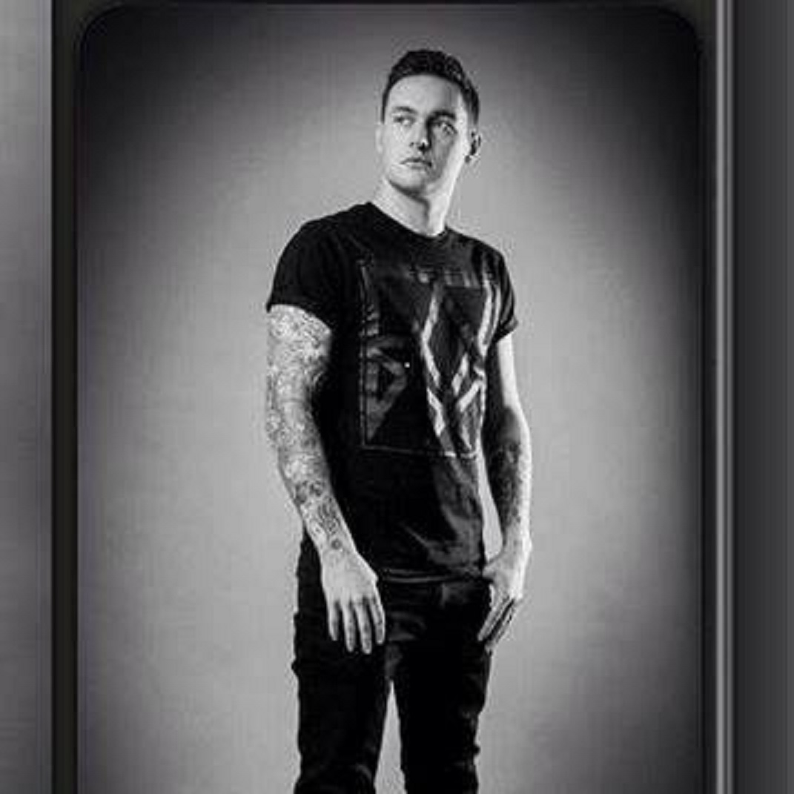

                                  ==  Stream 1 projoct ==
                                    
                                   Hero In Error band page
                                   
ABOUT:
For my stream one project I decided to make a website for my good friends who are in
a band called "Hero in error". Since I already have a huge interest in Music I was always
going to go down this route when it came to doing not just this project but other projects in my time in
Code Institute.
The band members gave a clear indication of what they wanted ( As they actually use it now for there 
offical site ).

1. Home Page

2. A photo Gallery 

3. A video page

4. About page

the band did NOT want any tracks put on the site as they wanted more visitors to view there Social media links
such as spotify and Instagram. Links to these sites where placed on the top right hand corner of the Navbar. This was important for the band
as Social Media is so important for any band to gain fans and plays.

Planning:

Part of the project was the blue print or the thinking about the design for the project. This was done by using a piece of software
called Balsamiq. This software allowed you to create a wireframe that helped visually get a rough idea of how you wanted to
get your website to look like.
This was very helpful as it actually feeds creativity and allows you try out other ideas on paper before you even start to code.

It was very important to me to pick a suitable Bootstrap theme to work with for this project as it was my first website I ever made
and wanted it to look professional and most importantly help boost my confidence.

in the end I went for the "Modern Business template" which I founda at startbootstrap.com

Link to Theme is below.

https://startbootstrap.com/template-overviews/modern-business/

I Picked this one mainly because I really liked the layout and it gave me plenty to work with in how much
content was available on the page, I ended up cutting the templates down on each one my pages so I could
tailor how exactly I wanted each page look. Then that allowed me to place the content I wanted 
on each page.

All images and Videos where taken from the bands social media sites with there permission.

1.HOME PAGE:

Started with making a responsive NavBar for this page ( all of the other pages have the same Navbar )
The navbar consists of the Hero in error Logo in the far left hand corner which I designed myself using
the font "Meta Mania" which is a font I used a lot on this site as I felt it suited the theme of a Metal band very well.

<link href="https://fonts.googleapis.com/css?family=Metal+Mania|Ravi+Prakash" rel="stylesheet">

where you can find font above.

Navbar also consists of three page links.

1.Videos
2.Gallery
3.About

and to the far right you will be able to see Social media icons that link you directly each of
the bands social media sites.

Directly underneath I placed a carousel image display to automatically shuffle between some of the bands photos.
Each picture has a caption with a small bit of text saying "Live updates" etc. a timer was set using Javascript to switch between each photo
on the carousel.

 
    
The rest of the home page was used to make an introduction for the band and list some bands that are similiar to them
so fans could have an idea of what they where like before they listened to them.

To the right you see a see a picture with the latest "Hero in error" release. This pictire used the same colour theme as the background image used 
for the home page. This was the signature artwork used for the bands latest release so it was important to use it anywhere I could to help
give the page the most up to date relevance.

At the bottom of the Home page you will see that I have placed in a form.
the form is there to sign up for a news letter for all the latest news with the band.
the form consists of:

1.Your Name
2.Email Address
3. Mobile Number

And a submit button is placed at the bottom of the form.

There are a few conditions to this form though. If you click Submit without filling in any of the fields it will show you a pop up
message stating "please fill out this field".

If you have no "@" in the email section it will tell you that you need one present.

For the phone number you must place ten digits in for the number and it has to start with "08"

only then will the Submit button allow you to move forward.

2. VIDEOS

This page consisted of all of the visual media needed for the site.
This was pretty basic layout with nothing to crazy going on.
I placed two videos directly underneath of each other with a heading for both and a 
quick paragraph to the right of each Video with a short description of each one.
the background image I changed from the home page mainly just to change it up and add some 
variety. It is also wise to note that I created seperate external CSS stylesheets for each one of the pages,
with each one slightly different to eachother.

The two videos featured where consisted of

1. Teaser video for the band new EP.
2. Live Video in dublin

The first video I have set to start playing at 6 seconds into the video as the Hero in Error Logo is 
visible at that point. As you you can see I have used the "Metal mania" font again for each heading on the videos.
For the heading on the paragraph I have gone for a font called "Oswald" to change thing up with a light blue Colour 
to add to it.

Code used for header:

h3{
 font-family: 'Oswald', sans-serif;
 color: #0066ff;
}

At the end of the page you will notice four thumbnails that when clicked bring you to various Hero in Error related Videos on youtube.
Each thumbnail has a link URL attached to it for example.

                            
                        

                        
                        
                        
3. GALLERY

The gallery was important to me as I wanted to really make this stand out. Due to my limited state of a developer at the time I did a lot of research 
on how to make the best Photo gallery possible. After going down many avenues I came across a great video tutorial called

"How to create a lightbox style bootstrap Photo gallery"
Link below.

https://www.youtube.com/watch?v=4pKmD-ujV9Q&t=40s

In this tutorial it went through the html structure for the page and the general layout. I set up my images folder and linked all of the
images I needed in groups of 4. 16 photos needed all together.
I created a lightbox.css file that was required for this. The only trouble with this is that I couldnt get the the "load", "left", right"
images to work when I was coding in the CSS. You can see the code at the top of the CSS page.

When you look at the photo gallery MAKE SURE that you click on the photos. This will prompt the lightbox function to kick in and display 
the image on the front of the screen. Use the arrows on your keypad to navigate through the photos. Notice that the lightbox feature
expands to the size of the photo.

In order to achieve this Javascript/jQuery where used. This code can be found in the js folder marked lightbox.min.js,
This code was supplied by the video tutorial.

As on previous pages a seperate CSS page was created called "Gallery.css." The only major diffence on this one was the background image change.

4. ABOUT

this page consists of a bio for each one of the members in Hero in Error.
Two active members at this moment.
Also I used a background video to play in the background which was an exciting feature to use.

To achieve this I got the help from from A website that gave me a step by step tutorial on how to do this.

Here is the link

https://slicejack.com/fullscreen-html5-video-background-css/

It showed me how to embed the video properly and make every format possible be able to play.

    <video loop muted autoplay poster="img/videoframe.jpg" class="fullscreen-bg__video">
      <source src="Videos/TheHollowTruth.webm" type="video/webm">
        <source src="Videos/TheHollowTruth.mp4" type="video/mp4">
          <source src="Videos/TheHollowTruth.ogv" type="video/ogg">
          </video>
        

      
  
      
  It also gave lines of css to position the video correctly and it also made use
  of Media Queries which is a topic we covered Stream 1.
  
  
 
 Testing: 
 
 Testing was used throughtout the whole process of making this project. Mainly tesing links between each pages to see if they where
 running smoothly.
 
 Project was Built with:
 
 *HTML 5
 
 *CSS3
 
 *Bootstrap for the responsive Navbar, paragraph segments and image placement
 
 *Javascript and jQuery used for lightbox feature (Gallery), Carosuel timing.
 
 
 Deployment:
 
 This page was deployed on Github pages. Link below
 
 https://briansheridan.github.io/Stream-One-Project/
 
 Live demo:
 
 is available at https://briansheridan.github.io/Stream-One-Project/
 
 
 
 
 
 

                                   
